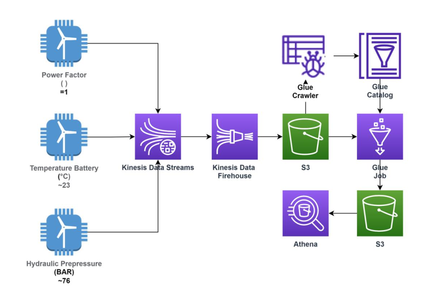
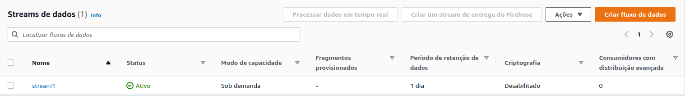
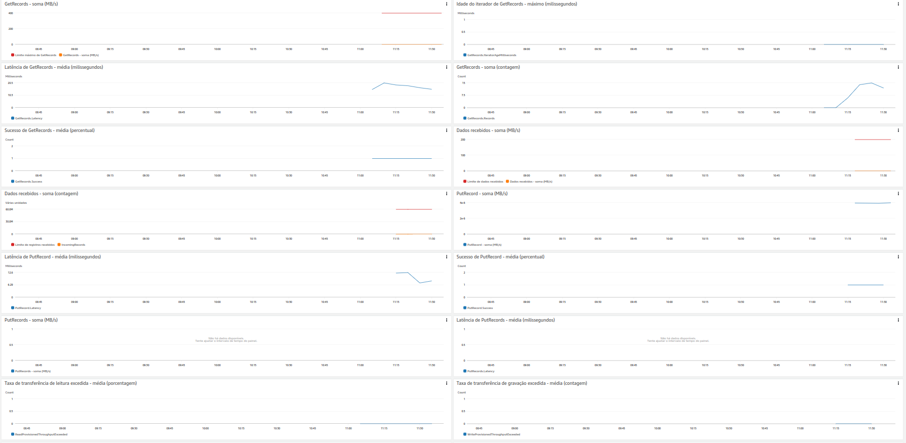
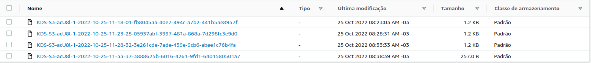
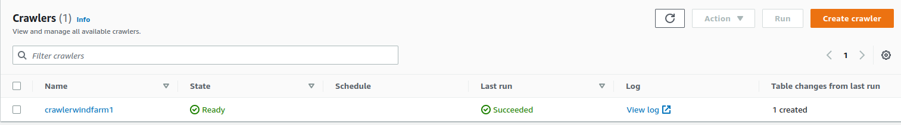
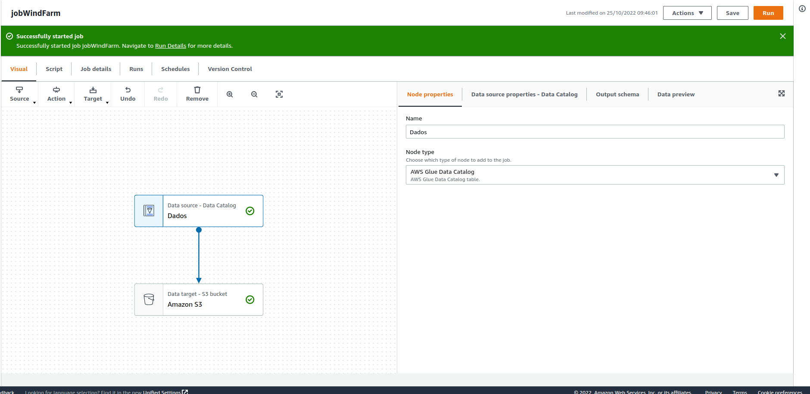
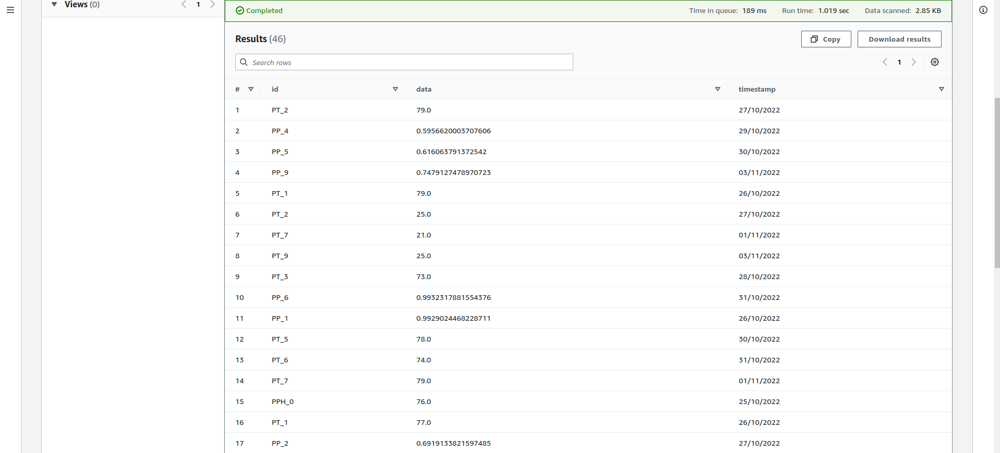

# Projeto 2: WindFarm

O Wind Farm é uma usina de energia eólica ficticia que gera dados diariamente. Esses dados precisam ser armazenados em um datalake para que a equipe de dados possa análisa-los. Para isso se projetou a seguinte arquitetura:

Nessa arquitetura podemos observar que os dados serão originados de 3 produtores:**Power Factor**, **Temperature Battery** e **Hydraulic Pressure**. Esses dados serão disponibilizados no Kinesis data stream que ira reter os dados que serão transferidos para um bucket S3 via kinesis firehouse. Depois esses dados são rastreados e catalogados  em uma tabela pelo ferramenta glue, usando o crawler. Após isso os dados serão carregados no datalake no s3 e acessados usando o athena.

Os dados produzidos terão o formato chave-valor com as seguintes chaves:
* id: um identificador unico;
* data: valor gerado;
* type: que pode de 3 tipos: **Power Factor**, **Temperature Battery** e **Hydraulic Pressure**;
* date: o dia em que foram gerados.
 
 Essas informações serão colocados no formato json.    

Os produtores foram simulados usando os 3 codigos python disponiveis no repositório. As figuras abaixo traz o stream de dados e suas metricas de desempenho:

 Os dados foram para o kinesis que o colocaram no bucket do s3. Com os dados no s3, criamos um crawler para pegar os dados e catalogalos em um database no glue. As figuras abaixos mostram os resultados:

 
 
 

 O crawler ao final gerou 1 tabela. O resultado e mostrado na figura abaixo:

 

Depois criou-se um job no glue studio para transferir esses dados do databese no glue para o datalake no s3 e  convertelos para o fformato parquet.

Com isso os dados passaram a poder ser acessados por qualquer serviço da aws  A figura  abaixo mostram os dados que passaram por todo o processo e sendo acessados usando a ferramenta athena

